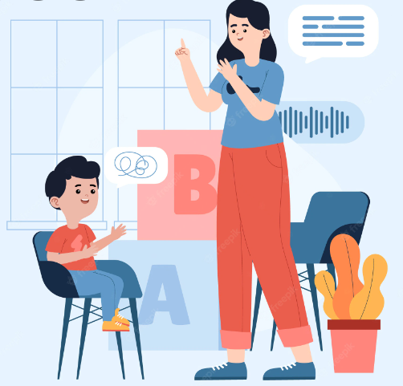

# Speech-Rehabilitation-Application
Mobile and Web speech rehabilitation application for Arabic language speakers

<!-- ## Paper
<embed src="/Paper/Report.pdf" type="application/pdf"> -->

<h2> Prerequests </h2>

1.  Python 3.8.8
2.  Node.js v16.14.0
3.  expo 5.2.0
4.  mysql server (Ammps - Microsoft Sql Server)

<h2> Contents </h2>

1.  [Introduction](https://github.com/Radwa-Saeed/Speech-Rehabilitation-Application#1-introduction)
2.  [User Interface & App Features](https://github.com/Radwa-Saeed/Speech-Rehabilitation-Application#2-user-interface)
3.  [Server](https://github.com/Radwa-Saeed/Speech-Rehabilitation-Application#3-server)
4.  [Paper](https://github.com/Radwa-Saeed/Speech-Rehabilitation-Application#4-Paper)
5.  [Presentation](https://github.com/Radwa-Saeed/Speech-Rehabilitation-Application#5-Presentation)

## 1. Introduction 
- People having problems in pronouncing some letters are facing
many challenges as their speech wouldn't be totally understandable and that may cause
psychological issues.

* So we have developed a web and mobile application to help those people practice pronunciation and restore their ability to conversate fluently, also this app would be able to express the needs of those who can't talk easily.

## 2. User Interface

1. ### The main page

    -   First of all the user has to register to the application. 
    -   The user can register to the app as doctor or patient.
     
    

    - Then the app will redirect the user to log-in to the application.

     

2. ### Doctor Log-In

    - Here is an example of a doctor log-in where the application redirects the doctor to the patient's history to be reviewed.
    - There is also a search section to get a specific patient with their name.
    

    - Patients Data
    

    
    - Patient History 
    

    

3. ### Patient Log-In

    -   When the role of the user is a patient the application redirects the patient to choose from two different modes:  
    

    -   **The first mode is coach mode** (frequently repeating words to the person): 
    The patient has to select, listen, and re-pronounce selected word to practice on follow up the progress of patients.

    

    -   Reference And Recorded Audio Signal Graph
    

    

    -   **The second mode is assistant mode** (speaking words and presenting objects that can
    be seen): 
    help people regain some ability to use language. This part is done by selecting a category from different categories (names, objects, food, ......., etc.) which had been stored in database and playing the audio associated with the category selected in order to help stroke Alzheimer people to remember things, family and different objects and contribute with society in an effective way.
    
    

## 3. Server
-   Database Tables

-   Audio Table Example 

    

